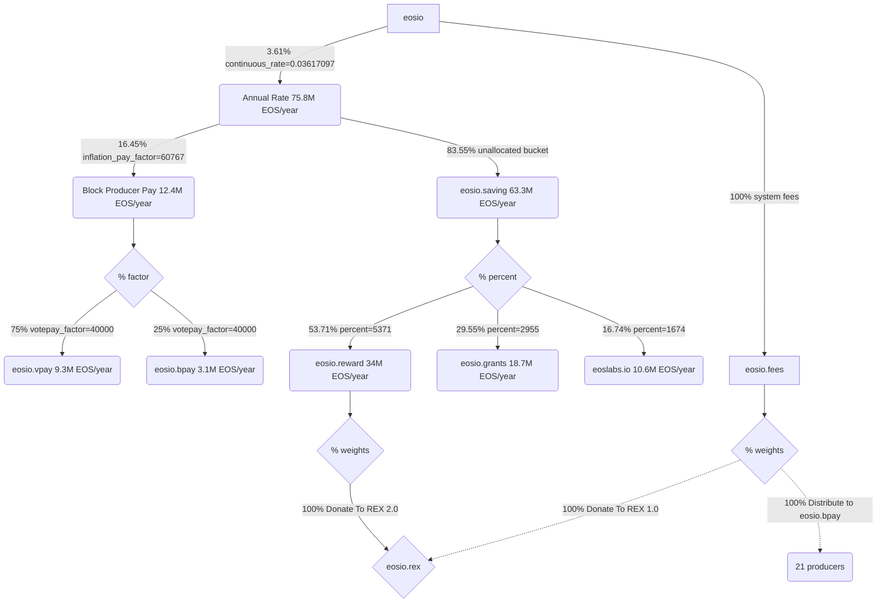

# EOS Tokenomics (System Contract v3.4.0 Upgrade)

> [v3.4.0 Release Notes](https://github.com/eosnetworkfoundation/eos-system-contracts/releases/tag/v3.4.0)

### Token distribution flowchart



### Allocations (Annual Rate)

| Sender | Receiver | Allocation (%)| Amount/year |
|--------|-------|------------|--------|
| eosio  |       | 100% | 75,959,037 EOS |
| eosio | eosio.saving | 83.55% | 63,300,000 EOS |
| eosio | producer pay | 16.45% | 12,400,000 EOS |
| producer pay | eosio.vpay | 75% | 9,375,035 EOS |
| producer pay | eosio.bpay | 25% | 3,125,011 EOS |
| eosio.saving | eosio.reward | 53.71% | 34,083,823 EOS |
| eosio.saving | eosio.grants | 29.55% | 18,752,131 EOS |
| eosio.saving | eoslabs.io | 16.74% | 10,623,034 EOS |

## [Build CDT](https://github.com/AntelopeIO/cdt) (`v4.0.1`)

```bash
git clone --recursive https://github.com/AntelopeIO/cdt
cd cdt
git checkout v4.0.1
mkdir build
cd build
cmake ..
make -j $(nproc)
```

## [Compile EOS System Contracts](https://github.com/eosnetworkfoundation/eos-system-contracts/releases/tag/v3.4.0) (`v3.4.0`)

```bash
gh repo clone eosnetworkfoundation/eos-system-contracts
cd eos-system-contracts
git checkout v3.4.0
export CDT_INSTALL_DIR="<path>/cdt/build"
./build.sh
```

## Contract `sha-256` checksums
```bash
$ shasum -a 256 ./build/contracts/**/*.wasm
c54c983e9702d395af6262e7235aaee1f1e27b7126f9e19bf5964d63b4a7d8fa  ./build/contracts/eosio.fees/eosio.fees.wasm
b78e2bfcceea88b337f195bb1e362a33cb5365aaaf02a2c32bcbf6698b1b832f  ./build/contracts/eosio.system/eosio.system.wasm
0a16e1dac533c4558698c8754f41219839ba2a2b75e517e65ea2537f76681f49  ./build/contracts/eosio.token/eosio.token.wasm
```

```bash
$ shasum -a 256 ./build/contracts/**/*.abi
1b7153927691bc464602f0aadd8badfa25e92926342e6294967ad2f2cc66564e  ./build/contracts/eosio.fees/eosio.fees.abi
ce92b0030ef8413c55de96bf807a5740181d02880b825ff98b7fe9b471d999c2  ./build/contracts/eosio.system/eosio.system.abi
6961da382f16caddc255acd287d3f19011aa1d4ddcc7be5955768b4629ec9b16  ./build/contracts/eosio.token/eosio.token.abi
```

#### ❗️ PREREQUISITE - Deployed `v3.4.0` system contracts

https://github.com/eosnetworkfoundation/eos-system-contracts/releases
- Create new systems accounts for:
  - `eosio.fees` (15/21) (`eosio` + `@eosio.code`)
  - `eosio.reward` (15/21) (`eosio` + `@eosio.code`)
- Deploy new `eosio` system contract
- Deploy new `eosio.token` contract
- Deploy new [`eosio.fees`](https://github.com/eosnetworkfoundation/eosio.fees/releases/tag/v1.0.0-rc1) contract


### MSIG - EOS Tokenomics

1. Set MSIG execution time

**time.eosn::checktime**
```json
{
    "time": "2024-06-01T00:00:00.000Z"
}
```

#### B1 unvest
2.1. Unvest B1 tokens (35M EOS NET + 29.6M EOS CPU)

**eosio::unvest**
```json
{
    "account": "b1",
    "unvest_net_quantity": "35007851.2340 EOS",
    "unvest_cpu_quantity": "29662497.5145 EOS"
}
```

2.2. Tokens are retired from active supply

#### Set Max Supply
3.1. Set max supply 2.1B

**eosio.token::setmaxsupply**
```json
{
    "issuer": "eosio",
    "maximum_supply": "2100000000.0000 EOS"
}
```

3.2. Issue fixed supply up to 2.1B (expected ~972M EOS)
**eosio.token::issuefixed**
```json
{
    "to": "eosio",
    "supply": "2100000000.0000 EOS",
    "memo": "EOS Tokenomics"
}
```

#### Transfer to EOS Distribution

4.1. Create new distribution accounts
- `eosio.mware` (2/2) (`eosio.grants` + `eoslabs.io`)
- `fund.wram` (2/2) (`eosio.grants` + `eoslabs.io`)
4.2. Transfer 350M from `eosio` to `fund.wram`
4.3. Transfer 15M from `eosio` to `eosio.mware`

```json
[
    { "from": "eosio", "to": "fund.wram", "quantity": "350000000.0000 EOS", "memo": "EOS Tokenomics" },
    { "from": "eosio", "to": "eosio.mware", "quantity": "15000000.0000 EOS", "memo": "EOS Tokenomics" },
]
```

4.4. Remaining ~607M EOS in `eosio` to be distributed via producer pay & `eosio.saving`

#### Set vesting
5.2. Adjust `inflation_pay_factor=60767` factor ratio to:

| ratio  | receiver |
|--------|----------|
| 16.46% | block producers (**bpay** & **vpay**)
| 83.54% | `eosio.saving` (Rewards, ENF & Labs)

**eosio::setpayfactor**
```json
{
    "inflation_pay_factor": 60767,
    "votepay_factor": 40000
}
```

5.3. Set 4 year halvening schedules (up to 20 years, 6 schedules)

**eosio::setschedule** (multiple actions)
```json
[
  {"start_time": "2024-06-01T00:00:00Z", "continuous_rate": 0.03617097},
  {"start_time": "2028-06-01T00:00:00Z", "continuous_rate": 0.01808549},
  {"start_time": "2032-06-01T00:00:00Z", "continuous_rate": 0.00904274},
  {"start_time": "2036-06-01T00:00:00Z", "continuous_rate": 0.00452137},
  {"start_time": "2040-06-01T00:00:00Z", "continuous_rate": 0.00226069},
  {"start_time": "2044-06-01T00:00:00Z", "continuous_rate": 0.00113034}
]
```

5.4. Execute next schedule
**eosio::execschedule** (no payload)
```
{}
```

#### Set `eosio.savings` distribution

6.1. Set `eosio.savings` ratios

| ratio  | receiver |
|--------|----------|
| 53.71% | Staking Rewards (`eosio.reward`)
| 29.55% | ENF (`eosio.grants`)
| 16.74% | Labs (`eoslabs.io`)

**eosio.saving::setdistrib**
```json
[
  {"account": "eosio.reward", "percent": 5371},
  {"account": "eosio.grants", "percent": 2955},
  {"account": "eoslabs.io", "percent": 1674}
]
```

> https://bloks.io/msig/larosenonaka/eosio.fees

#### Configure System Fees
7.1 Set incoming fees to 100% go to REX via `donatetorex` strategy

**eosio.fees::setstrategy**
```json
{
    "strategy": "donatetorex",
    "weight": 10000
}
```

### Init Fees

7.2 Initialize fees contract to 600 seconds per epoch period

**eosio.fees::init**
```json
{
    "epoch_period": 600
}
```
